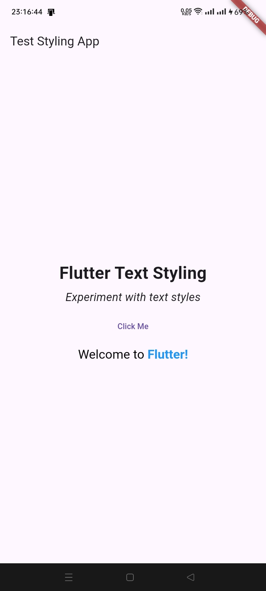
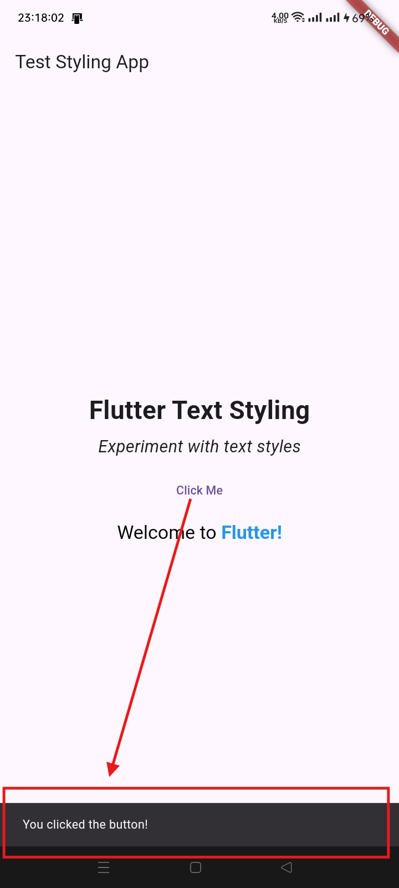

# Text Styling App

Live Test - Flutter Text Styling App

## Screenshots

### Before Pressing the Button


### After Pressing the Button


## Code

### `main.dart`

```dart
import 'package:flutter/material.dart';

void main() {
  runApp(MyApp());
}

class MyApp extends StatelessWidget {
  @override
  Widget build(BuildContext context) {
    return MaterialApp(
      title: 'Text Styling Flutter App',
      home: TextStylingPage(),
    );
  }
}

class TextStylingPage extends StatelessWidget {
  @override
  Widget build(BuildContext context) {
    return Scaffold(
      appBar: AppBar(
        title: Text('Test Styling App'),
      ),
      body: Center(
        child: Column(
          mainAxisAlignment: MainAxisAlignment.center,
          children: <Widget>[
            // Title
            Text(
              'Flutter Text Styling',
              style: TextStyle(
                fontSize: 30.0,
                fontWeight: FontWeight.bold,
              ),
            ),
            SizedBox(height: 6.0),
            // Subtitle
            Text(
              'Experiment with text styles',
              style: TextStyle(
                fontSize: 20.0,
                fontStyle: FontStyle.italic,
              ),
            ),
            SizedBox(height: 10.0),
            // TextButton
            TextButton(
              onPressed: () {
                // Displaying the Snackbar
                ScaffoldMessenger.of(context).showSnackBar(
                  SnackBar(
                    content: Text('You clicked the button!'),
                  ),
                );
              },
              child: Text('Click Me'),
            ),
            SizedBox(height: 8.0), 
            // New Line of Text
            RichText(
              text: TextSpan(
                children: <TextSpan>[
                  TextSpan(
                    text: 'Welcome to ',
                    style: TextStyle(color: Colors.black, fontSize: 20.0),
                  ),
                  TextSpan(
                    text: 'Flutter!',
                    style: TextStyle(color: Colors.blue, fontSize: 20.0, fontWeight: FontWeight.bold),
                  ),
                ],
              ),
            ),
          ],
        ),
      ),
    );
  }
}
